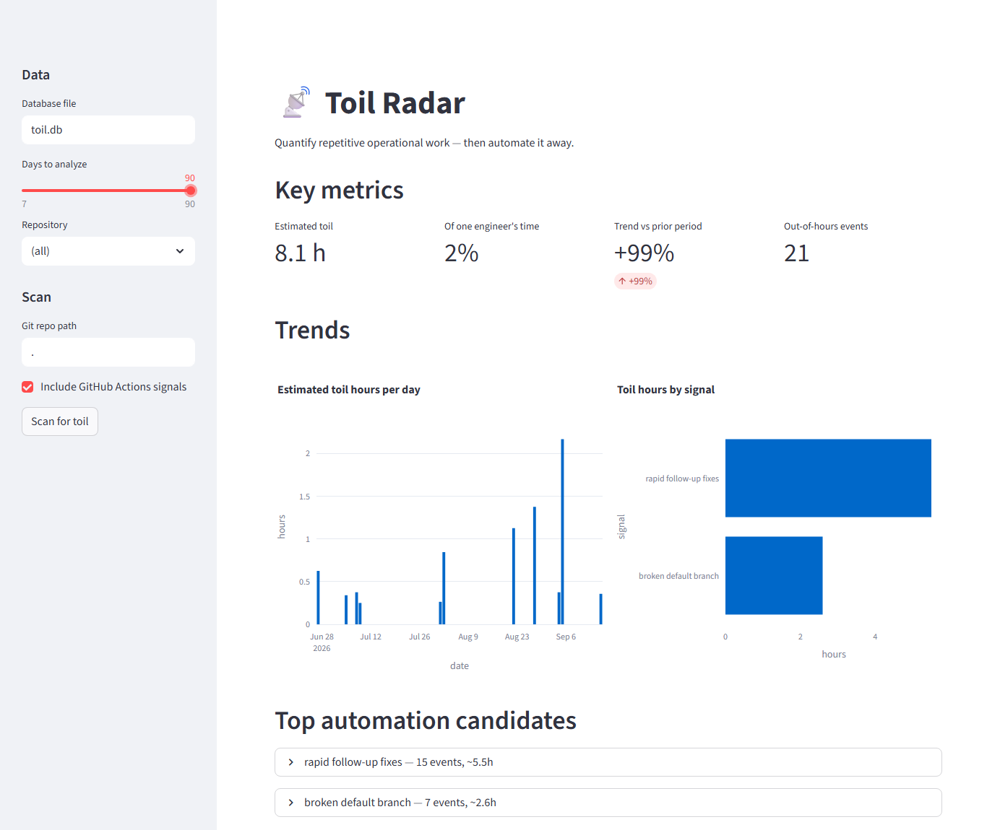

# toil-radar

Estimates how much time a team loses to toil (reverts, hotfixes, flaky CI, manual button-pushing) from signals already in git history and GitHub Actions. Point it at a repo and get back estimated hours, a trend, and a ranked list of what to automate first.



*The optional dashboard, scanning seven repositories over 90 days. The CLI reports the same numbers as text.*

The SRE handbook says to keep toil under 50% of engineering time. Almost nobody measures it. Grepping commit messages for "fix" doesn't work because it flags half of normal development, so toil-radar only counts events that don't happen unless someone was cleaning up a mess:

| signal | what happened |
|---|---|
| `revert` | a revert or rollback commit |
| `hotfix_merge` | a merge from a hotfix or emergency branch |
| `quick_fix` | the same author patched the same file again within 2 hours, with a corrective message |
| `ci_rerun` | a workflow run needed more than one attempt |
| `manual_dispatch` | someone triggered a workflow by hand |
| `broken_main` | the default branch went red and someone fixed it forward |

The git signals work offline. The three GitHub Actions signals use the `gh` CLI if it's installed and authenticated, and are skipped if not.

`broken_main` counts episodes, not failures. Consecutive failed runs of one workflow on the default branch collapse into a single event that ends at the next green run, so three failed pushes in ten minutes count as one person fixing one mistake. The episode is costed by how long the branch stayed red, with a floor of 10 minutes and a cap of 2 hours. An episode that is still red at scan time isn't counted until it recovers.

Each episode also records the commit its first failing run was built from, so `summary` can name the commit that broke the branch instead of everything that landed nearby. Commits older than the scanned history don't contribute.

Every other event gets a rough cost in minutes. The weights are in [`toil_radar/git_signals.py`](https://github.com/amrutp24/toil-radar/blob/main/toil_radar/git_signals.py) and err low. Anything that started on a night or weekend counts 1.5x. The total is not payroll-accurate. It is a consistent number you can trend over time and use to decide what to automate first. Rescanning never double-counts; events are deduplicated by commit hash or run id.

## Install

```bash
pip install toil-radar               # CLI, no dependencies
pip install "toil-radar[dashboard]"  # adds the Streamlit dashboard
```

## Usage

```bash
toil-radar scan /path/to/repo        # add --no-github to skip the gh API
toil-radar scan . --days 60
toil-radar scan ~/code/*             # several at once
toil-radar summary
toil-radar summary --repo /path/to/repo --days 90
toil-radar export --output /var/lib/node_exporter/toil.prom
toil-dashboard
```

Scans accumulate in one database. `summary` aggregates across every repo you've scanned unless you filter with `--repo`. `scan` takes any number of paths, and a bad one doesn't abort the rest: anything in the list that isn't a git repo is reported and skipped, so globbing a directory of projects works. The exit code is non-zero if any path failed.

## Prometheus

`export` writes the stored metrics in Prometheus text format, so you can trend toil over months instead of looking at one window. Point `--output` at the node_exporter textfile collector's directory and run it on a schedule. The file is written and then renamed into place, so a scrape never catches it half-written.

```
toil_radar_events{repo="/srv/app",signal="broken_main"} 3
toil_radar_seconds{repo="/srv/app",signal="broken_main"} 3084
toil_radar_night_weekend_events{repo="/srv/app"} 9
toil_radar_capacity_ratio 0.004
toil_radar_window_seconds 15552000
```

Values are in seconds because that's the Prometheus convention, even though the CLI talks in minutes and hours. CI runs `promtool check metrics` over the output on every push, so a real Prometheus parser checks the format.

## Example

Real output from scanning this repo:

```
Toil Radar - last 180 days - all repos
============================================================
Estimated toil: 4.6h (~0% of one engineer's time)
Out-of-hours events: 9 (nights/weekends)

signal                        events  est. hours
------------------------------------------------
rapid follow-up fixes             10         3.4
broken default branch              3         0.9
CI re-runs                         1         0.3

Churn hotspots (same file touched in many commits):
  pyproject.toml  (11 commits)
  tests/test_basic.py  (8 commits)
  README.md  (6 commits)
  CHANGELOG.md  (6 commits)

What broke the default branch:
  tests/test_basic.py  (2 of 3 episodes)
  toil_radar/store.py  (1 of 3 episodes)
  toil_radar/__init__.py  (1 of 3 episodes)

Top automation candidates:
1. rapid follow-up fixes: 10 events, ~3.4h
   Fix-the-fix churn means feedback arrives too late - add the missing
   linter, type check, or test that would catch these pre-push.
   e.g. "Fix author date parsing on Python < 3.11 (trailing Z)" (2026-07-09)
2. broken default branch: 3 events, ~0.9h
   Breakage is landing on the default branch and being fixed forward under
   pressure - gate merges on the checks that failed, so the build breaks in
   a PR instead of on main.
   e.g. "CI red on main for 15 min (1 failed run)" (2026-07-09)
3. CI re-runs: 1 events, ~0.3h
   Re-run workflows usually mean flaky tests or flaky infra - quarantine
   the flakiest jobs and fix them; every re-run is babysitting.
   e.g. "Publish to PyPI re-run (attempt 3)" (2026-03-30)
```

This matches what actually happened. The packaging churn was toil, the PyPI publish did take three attempts, and the red-main episodes were real. The attribution is also right: `tests/test_basic.py` is behind two of the three episodes, and the July one traces to the detection-engine rewrite, fixed twenty minutes later by "Fix author date parsing on Python < 3.11".

## Development

```bash
git clone https://github.com/amrutp24/toil-radar
cd toil-radar
pip install -e ".[dashboard,dev]"
pytest
```

## Roadmap

- deploy→fix→deploy loop detection
- per-team and per-author views

## License

MIT, see [LICENSE](https://github.com/amrutp24/toil-radar/blob/main/LICENSE)
